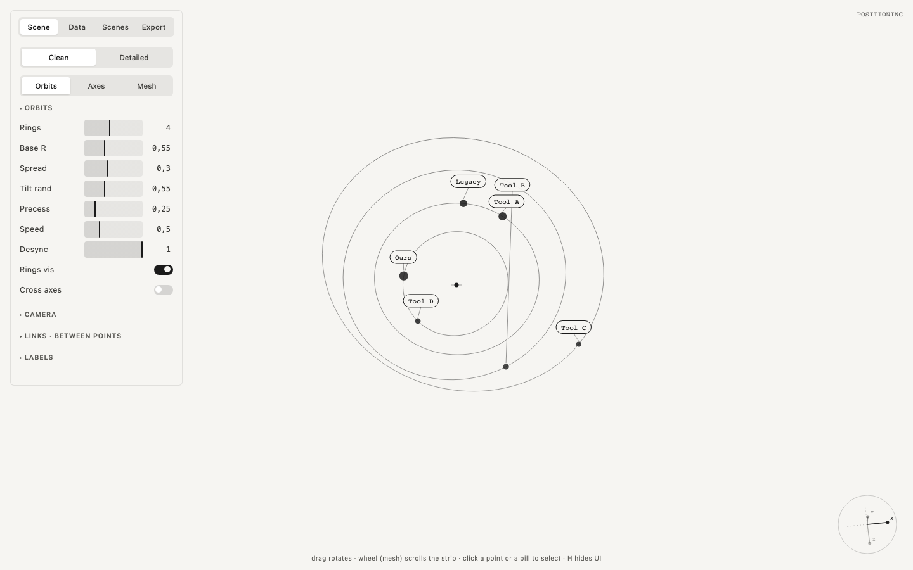

  

<h1 align="center">Orbital</h1>

  Data as orbits, axes or a bending mesh 
  one HTML file · runs in the browser · no install · free and open source

  <a href="https://robvagin-beep.github.io/orbital/"><b>Open Orbital</b></a> ·
  <a href="#run-it">Run it</a> ·
  <a href="#more-tools">More tools</a>

---

One dataset, three ways to look at it. Points ride rings, sit in a space of your own axes, or weigh down a grid like stars bending space.

## What it does

- **Three modes from one dataset:** Orbits (rings around a center), Axes (a 3D map on axes you name), Mesh (a grid that heavy points pull down)
- **Points** with labels, weights and notes that open as bubbles; links between them
- **Keyframes:** keep a view, set the seconds to the next one, play them all
- **Record** the canvas to WebM in one pass, without the panel
- **Export:** PNG and a JSON config with parameters and data

## Run it

Open [robvagin-beep.github.io/orbital](https://robvagin-beep.github.io/orbital/), or download `index.html` and open it from your disk. It is the whole tool: no build step, no dependencies, no network. Press **H** to hide the panel.

## Made by a designer

I'm a designer. I build small tools like this for my own work, with AI agents: I make the decisions, Claude Code writes the code. The panels follow one grammar across the whole set.

Take it if you want it.

## More tools

- [Particle Dance](https://github.com/robvagin-beep/particle-dance) · particles that dance along patterns and 3D forms
- [Murmur](https://github.com/robvagin-beep/murmur-vj) · a VJ visualizer: circles, triangles and squares that move to your music
- [Metaballs](https://github.com/robvagin-beep/metaballs) · soft masses that merge, split and leave holes
- [Halftone Cloud](https://github.com/robvagin-beep/halftone-cloud) · images rebuilt as a halftone of flying shapes
- [Logomachine](https://github.com/robvagin-beep/logomachine) · seeded generative marks: one seed, one pattern, always
- [Motion Primer](https://github.com/robvagin-beep/motion-primer) · bodies with behaviors: swarm, pack, magnet, orbit, fall, scatter
- [Particles 3D](https://github.com/robvagin-beep/particles-3d) · a WebGL2 cloud of up to 300,000 particles
- [Pixel Ring](https://github.com/robvagin-beep/pixel-ring) · rings drawn in pixels
- [Motion Pad](https://github.com/robvagin-beep/motion-pad) · one pad for the character of motion

## License

[MIT](LICENSE) © 2026 Robert Vagin
